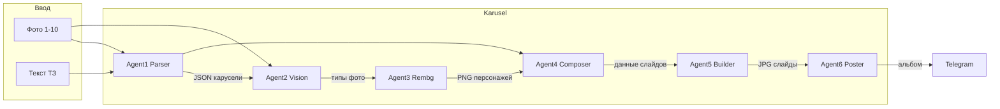

# План: Агент карусели в папке Karusel

## Текущее состояние

- В репозитории уже есть папка **Karusel/** с пользовательским контентом (фото, ChatExport, папки Массаж/СУВ/шаги бота). Код агентов размещается рядом: новые директории `agents/`, `templates/`, `handlers/`, `models/`, `assets/` внутри Karusel — без перезаписи существующих файлов.
- **Telegram-бота в проекте нет** — aiogram не используется. Бот будет добавлен как часть Karusel (опциональный entry point).
- **LLM**: в проекте используется [seo-agents/shared/api_client.py](d:\content-factory\seo-agents\shared\api_client.py) (`ask_ai(messages)`). Поддержки vision (передача изображений в API) там нет — для Agent 2 (Vision) нужен отдельный вызов с форматом `content: [{"type": "image_url", ...}, {"type": "text", ...}]` через тот же OpenAI-клиент или обёртку в Karusel.
- **Зависимости**: в [requirements.txt](d:\content-factory\requirements.txt) нет rembg, playwright, jinja2, aiogram, pydantic — их нужно добавить (pydantic может быть транзитивно от openai).

---

## Целевая структура (всё под Karusel)

```
Karusel/
├── agents/
│   ├── __init__.py
│   ├── orchestrator.py      # вызов агентов 1→2→3→4→5→6 по порядку
│   ├── agent1_parser.py     # LLM: текст ТЗ → JSON структура карусели
│   ├── agent2_vision.py     # Vision LLM: анализ фото → тип/качество/use_character
│   ├── agent3_rembg.py      # rembg: вырезка персонажа → PNG с alpha
│   ├── agent4_composer.py   # матчинг слайд↔персонаж/фон/иконки
│   ├── agent5_builder.py    # Jinja2 + Playwright → JPG слайды (параллельно)
│   └── agent6_poster.py    # отправка альбома в TG (aiogram)
├── templates/
│   └── carousel/
│       ├── cover.html
│       ├── benefits.html
│       ├── indications.html
│       ├── howworks.html
│       ├── target_audience.html
│       ├── results.html
│       ├── photo_raw.html
│       ├── cta.html
│       └── base.css
├── assets/
│   └── carousel/
│       ├── icons/           # тематические иконки (office, sport, vakht, elderly)
│       ├── decorations/    # декор PNG (опционально)
│       └── brand/
│           ├── colors.json  # #FFE033, #000, #FFF
│           └── (logo.png при необходимости)
├── handlers/
│   └── carousel_handler.py  # FSM: ожидание фото+текста, вызов orchestrator
├── models/
│   └── carousel_schema.py  # Pydantic: CarouselData, SlideData, Brand
├── prompts/
│   └── agent1_parser.txt    # системный промпт для Agent 1 (можно вынести в prompts/agents/ у корня проекта по желанию)
├── config/
│   └── brand_voice.json     # опционально, или брать из существующего load_brand_voice
├── run_bot.py               # точка входа: aiogram 3, роутер, car:enter → handler
└── run_pipeline_cli.py      # CLI: фото + текст → output dir (без бота, для тестов)
```

Ссылки на ключевые файлы проекта для интеграции:

- Конфиг и .env: [config/.env](d:\content-factory\config.env), [config/shared-config.json](d:\content-factory\config\shared-config.json). Для бота: `TELEGRAM_BOT_TOKEN`, при необходимости `OPENAI_API_KEY` / `BASE_URL` уже используются в api_client.
- Логирование: по аналогии с [seo-agents/shared/logger.py](d:\content-factory\seo-agents\shared\logger.py) — либо общий logger, либо свой в `Karusel/agents/` с тем же форматом.

---

## Поток данных (кратко)




---

## Пошаговая реализация

### 1. Зависимости и конфиг

- В **requirements.txt** добавить: `rembg[gpu]` (или `rembg` без gpu), `playwright`, `jinja2`, `aiogram>=3`, `pydantic`.
- После установки: `playwright install chromium`.
- В **config/.env** (или в README Karusel): опционально `TELEGRAM_BOT_TOKEN` для бота.
- В **Karusel/config/** или в корне Karusel: минимальный конфиг бренда (цвета, размер слайда 1080×1350). При желании — секция `carousel` в shared-config.json (пути к шаблонам, размеры).

### 2. Модели данных (Karusel/models/carousel_schema.py)

- **Brand**: name, city, phone, service.
- **SlideData**: id, type (cover | benefits | indications | howworks | target | results | photo_raw | cta), title, subtitle, bullets, closing_line, photo_index, use_character, character_position, need_icons, icon_hints.
- **CarouselData**: brand, slides (list[SlideData]).
- Выход Agent 1 парсить в эти модели; при необходимости поля расширить под composer (character_png, bg_photo, icons).

### 3. Agent 1 — Parser (Karusel/agents/agent1_parser.py)

- Вход: текст ТЗ (строка), количество фото (для индексов).
- Системный промпт: из файла Karusel/prompts/agent1_parser.txt (как в твоём документе — структура JSON, правила cover/benefits/…/cta, лимит 8 слайдов, только JSON без markdown).
- Вызов: использовать `seo-agents/shared/api_client.ask_ai()` с системным и пользовательским сообщением (ТЗ). Путь к api_client: через sys.path или относительный импорт от PROJECT_ROOT (как в [agent_2_brief.py](d:\content-factory\seo-agents\agent2_brief\agent_2_brief.py)).
- Выход: валидация через CarouselData, возврат объекта (или JSON для следующего агента).

### 4. Agent 2 — Vision (Karusel/agents/agent2_vision.py)

- Вход: список путей к фото (скачанным из TG или локально).
- Задача: для каждого фото вернуть has_person, person_position, background_type, photo_quality, recommended_use, suggested_slide_type (как в твоём JSON).
- Реализация: вызов LLM с vision. У текущего api_client нет передачи image — нужна локальная функция в Karusel: чтение файла → base64 или file URI → сообщение с content: [image_url, text]. Использовать тот же OpenAI-клиент из config (OPENAI_API_KEY + OPENAI_BASE_URL), модель с vision (например gpt-4o). Альтернатива: Ollama + LLaVA локально (отдельный URL в .env).
- Выход: list[dict] по одному на фото.

### 5. Agent 3 — Rembg (Karusel/agents/agent3_rembg.py)

- Вход: путь к фото (только те, где use_character=True или по решению composer).
- Использовать `rembg.remove()` с сессией `u2net_human_seg`, alpha_matting=True (как в твоём сниппете).
- Выход: сохранение PNG с прозрачностью, путь возвращается в словаре. Опционально: smart_crop по bbox альфа-канала под размер слайда (например 540×1350).

### 6. Agent 4 — Composer (Karusel/agents/agent4_composer.py)

- Вход: CarouselData (от Agent 1), результаты Vision (list), пути к PNG персонажей (от Agent 3).
- Логика: для каждого слайда сопоставить character_png (выбор лучшего фото по vision), bg_photo для cover, при need_icons — подбор иконок из assets/carousel/icons/ по icon_hints.
- Выход: list[dict] с полными данными для шаблонов (включая пути к файлам, тексты, флаги).

### 7. Agent 5 — Builder (Karusel/agents/agent5_builder.py)

- Шаблоны: Jinja2, директория Karusel/templates/carousel/. Маппинг type → имя файла (cover → cover.html, …).
- Рендер HTML с подстановкой путей к изображениям (file:// или передача base64 в data-URI при необходимости для Playwright). Стили: base.css подключать в шаблонах.
- Playwright: async, chromium, viewport 1080×1350, set_content(html), screenshot(path, type="jpeg", quality=92). Один браузер — параллельно несколько page для каждого слайда (asyncio.gather), затем browser.close().
- Выход: список путей к JPG в output_dir (slide_00.jpg … slide_07.jpg).

### 8. Agent 6 — Poster (Karusel/agents/agent6_poster.py)

- Вход: bot (aiogram Bot), chat_id, список путей к JPG, caption (опционально).
- send_media_group(InputMediaPhoto(FSInputFile(path), caption только для первого)).
- Возврат: успех/ошибка.

### 9. Orchestrator (Karusel/agents/orchestrator.py)

- Последовательность: 1 → 2 → 3 → 4 → 5 → 6 (или 5 → возврат путей, 6 вызывается снаружи при наличии бота).
- Вход: список путей к фото (временные или из handler), текст ТЗ, output_dir для слайдов, опционально chat_id и bot.
- Внутри: вызов Agent 1; сохранение фото во временную папку если пришли из TG; Agent 2 по списку фото; Agent 3 только для фото с персонажем; Agent 4; Agent 5; при bot/chat_id — Agent 6. Обработка ошибок и логирование на каждом шаге.

### 10. TG-бот и хэндлер (Karusel/handlers/carousel_handler.py, Karusel/run_bot.py)

- **run_bot.py**: загрузка .env из config/.env, создание Bot + Dispatcher, регистрация роутера из handlers/carousel_handler.
- **carousel_handler**: состояние FSM (например WaitingPhotos). По callback `car:enter` — переход в состояние, сообщение «Пришлите до 10 фото и текст ТЗ». По сообщению с фото + текст: скачивание фото во временную папку, извлечение caption/текста → вызов orchestrator (без bot/chat_id до шага 6, затем передача bot и message.chat.id в Agent 6). Ответ пользователю: «Готово» + альбом уже отправлен через Agent 6.
- Меню бота (главное меню с кнопкой «Карусель» → car:enter) можно сделать минимально в run_bot или отдельно menu_handler.

### 11. CLI без бота (Karusel/run_pipeline_cli.py)

- Аргументы: пути к фото (или папка), текст ТЗ (или путь к .txt), output_dir.
- Вызов только orchestrator до шага 5 (слайды в output_dir); шаг 6 не вызывать. Удобно для отладки шаблонов и rembg.

### 12. Шаблоны HTML/CSS

- base.css: общие стили (1080×1350, шрифты, #FFE033, белый, чёрный, закругления). Подключение в каждом .html.
- cover.html, benefits.html, …: по одному слайду, подстановка {{ title }}, {{ subtitle }}, {{ bullets }}, {{ character_path }}, {{ phone }}, и т.д. В cover — блок с персонажем (img) и контент-блок слева/справа в зависимости от character_position.
- photo_raw.html: только фото на весь слайд (без плашек).
- cta.html: призыв + телефон.

### 13. Ресурсы (assets/carousel)

- icons/: набор иконок по темам (office, sport, vakht, elderly и т.д.) — статичные PNG/SVG. Composer подставляет путь по icon_hints.
- brand/colors.json: цвета для шаблонов или для генерации inline-стилей при необходимости.

---

## Важные моменты

- **Пути**: все пути к шаблонам и ассетам — относительно корня Karusel или PROJECT_ROOT, задавать в orchestrator/agents через `Path(__file__).resolve().parents[1]` и т.п.
- **Конфликт с существующим Karusel**: только новые директории (agents, templates, models, handlers, assets, config, prompts) и файлы run_bot.py, run_pipeline_cli.py. Существующие фото и ChatExport не изменять.
- **Vision API**: если используешь только Perplexity в api_client — у него может не быть vision; тогда Agent 2 делать опциональным или с fallback: без vision все фото считать «raw» и use_character определять только по данным Parser (или эвристике по имени/порядку).
- **rembg**: при установке `rembg[gpu]` нужен onnxruntime-gpu; на CPU достаточно `rembg` и u2net_human_seg (чуть медленнее).
- **Правило git-sync**: после изменений в content-factory коммит через git-entuziastov.ps1 -project factory. Правки только в Karusel/ не затрагивают VPS/тему — deploy-theme не нужен.

---

## Порядок внедрения (рекомендуемый)

1. Создать структуру папок и модели (carousel_schema.py).
2. Промпт Agent 1 и agent1_parser.py; проверить вывод JSON на тестовом ТЗ.
3. Agent 3 (rembg) и Agent 5 (builder) с одним шаблоном (например cover.html) — проверить генерацию одного слайда.
4. Остальные шаблоны и base.css; Agent 4 (composer) без иконок; полный пайплайн 1→4→5 и CLI.
5. Agent 2 (vision) и интеграция в orchestrator; при необходимости fallback без vision.
6. Agent 6 и TG handler; run_bot.py и точка входа car:enter.
7. Добавить иконки и декор (assets), донастроить target_audience и composer по icon_hints.

