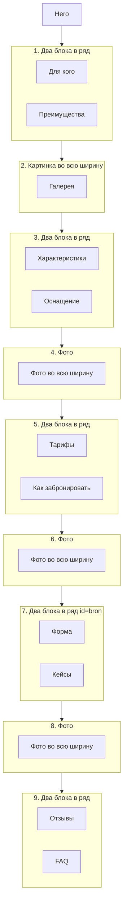

# Схема-макет лендингов залов

Краткая структура блоков и визуальная иерархия для лендингов конференц-зала.  
**Генерация:** цепочка агентов 1→9 (keywords → brief → content → editor → publish + images). Шаблон: `prompts/templates/konferenc_zal_page.md`. Стиль как на страницах услуг (`prompts/templates/service_page.md`).

---

## Схема чередования блоков (источник правды)

**Порядок:** два в ряд → фото → два в ряд → фото → два в ряд → фото → два в ряд → фото → два в ряд.

---

## Порядок секций (конференц-зал)

| № | Секция | Вёрстка | Класс |
|---|--------|---------|-------|
| 0 | Hero | Полная ширина | `.landing-hero` |
| 1 | Для кого + Преимущества | Два в ряд | `.landing-row-two-cols` |
| 2 | Галерея | Картинка во всю ширину | `.landing-gallery` |
| 3 | Характеристики + Оснащение | Два в ряд | `.landing-features-equipment` |
| 4 | Фото | Во всю ширину | `.landing-photo-full` |
| 5 | Тарифы + Как забронировать | Два в ряд | `.landing-pricing-booking` |
| 6 | Фото | Во всю ширину | `.landing-photo-full` |
| 7 | Форма + Кейсы | Два в ряд, якорь `#bron` | `.landing-form-cases` |
| 8 | Фото | Во всю ширину | `.landing-photo-full` |
| 9 | Отзывы + FAQ | Два в ряд | `.landing-testimonials-faq` |

---

## Порядок секций (общий справочник)

В конференц-зале блоки сгруппированы попарно в ряды (см. таблицу выше).

| Блок | Описание / контент | Пара в конференц-зале |
|------|---------------------|------------------------|
| Hero | 80–100vh, H1, подзаголовок, цена, 2 CTA | — |
| For Whom | Для кого — карточки | с Benefits |
| Benefits | Преимущества — карточки | с For Whom |
| Gallery | Галерея зала — сетка 3/2/1 | — |
| Features | Характеристики — dl/dt/dd или таблица | с Equipment |
| Equipment | Оснащение — список/сетка | с Features |
| Pricing | Тарифы — 3 карточки | с Booking Steps |
| Booking Steps | Как забронировать — нумерованные шаги | с Pricing |
| Form | Оставить заявку — форма или CTA | с Cases |
| Cases | Кейсы — карточки 2 колонки | с Form |
| Testimonials | Отзывы — карточки 2–3 колонки | с FAQ |
| FAQ | Частые вопросы — аккордеон | с Testimonials |

---

## Визуальная иерархия

- **Hero:** фон (фото зала + overlay 40–60%), H1 белым при фоне-фото, цена выделена жирным/иконкой.
- **H2:** 28–36px (desktop), 24–28px (mobile), margin-top 60–80px, по центру.
- **Карточки:** белый фон, `box-shadow: 0 2px 8px rgba(0,0,0,0.08)`, `border-radius: 8px`, отступы между карточками 20–30px.
- **Кнопки CTA:** min-height 50px, акцентный цвет (teal), в Hero — вторая кнопка outline («Тарифы» или «Подробнее»).
- **Чередование:** пары блоков в ряд (`.landing-row-two-cols`) чередуются с фото во всю ширину (`.landing-photo-full`) — стили в `landing-pages.css` (тема).

---

## Интеграция с WordPress

- **Источник контента:** цепочка агентов 1→9 (keywords → brief → content → editor) → `scripts/publish_konferenc_zal_from_md.py` (MD→HTML) → `post_content` через WP REST API.
- **Шаблон страницы:** «Лендинг Конференц-зал» (`template-page-landing-konferenc-zal.php`). При непустом `post_content` выводится он; иначе — статичный макет темы.
- **Запуск цепочки:** `python scripts/run_konferenc_zal_chain.py`
