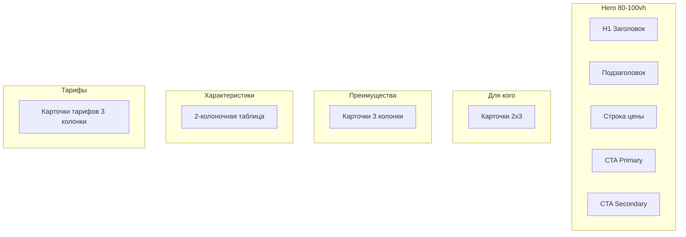

# Схема-макет лендингов залов

Краткая структура блоков и визуальная иерархия для лендингов конференц-зала, коучинга, тренажёрного зала и подстраниц.

## Блок-схема (Mermaid)

## Порядок секций

| № | Секция            | Описание / контент                                      |
|---|-------------------|---------------------------------------------------------|
| 1 | Hero              | 80–100vh, H1, подзаголовок, цена, 2 CTA (primary + outline) |
| 2 | For Whom          | Для кого / для каких мероприятий — карточки 2 колонки (desktop) |
| 3 | Benefits          | Преимущества — карточки 3 колонки                        |
| 4 | Features          | Характеристики зала — 2-колоночная таблица или карточки |
| 5 | Pricing           | Тарифы — 3 карточки (почасовая, полдня, день)          |
| 6 | Equipment         | Оснащение — иконки/галочки, 2 колонки                   |
| 7 | Booking Steps     | Как забронировать — нумерованные шаги                   |
| 8 | Form              | Оставить заявку — форма или CTA на форму на главной     |
| 9 | Gallery           | Как выглядит зал — сетка 3/2/1 колонки, lazy load       |
| 10| Cases             | Кейсы — карточки 2 колонки (title, client, goal, result) |
| 11| Testimonials      | Отзывы — карточки 2–3 колонки                          |
| 12| FAQ               | Частые вопросы — аккордеон                             |

Дополнительно на лендинге могут идти: калькулятор стоимости, контент из редактора (`the_content()`), блок «Нам доверяют», контакты и карта, sticky CTA.

## Визуальная иерархия

- **Hero:** фон (фото зала + overlay 40–60%), H1 белым при фоне-фото, цена выделена жирным/иконкой.
- **H2:** 28–36px (desktop), 24–28px (mobile), margin-top 60–80px, по центру.
- **Карточки:** белый фон, `box-shadow: 0 2px 8px rgba(0,0,0,0.08)`, `border-radius: 8px`, отступы между карточками 20–30px.
- **Кнопки CTA:** min-height 50px, акцентный цвет (teal), в Hero — вторая кнопка outline («Тарифы» или «Подробнее»).
